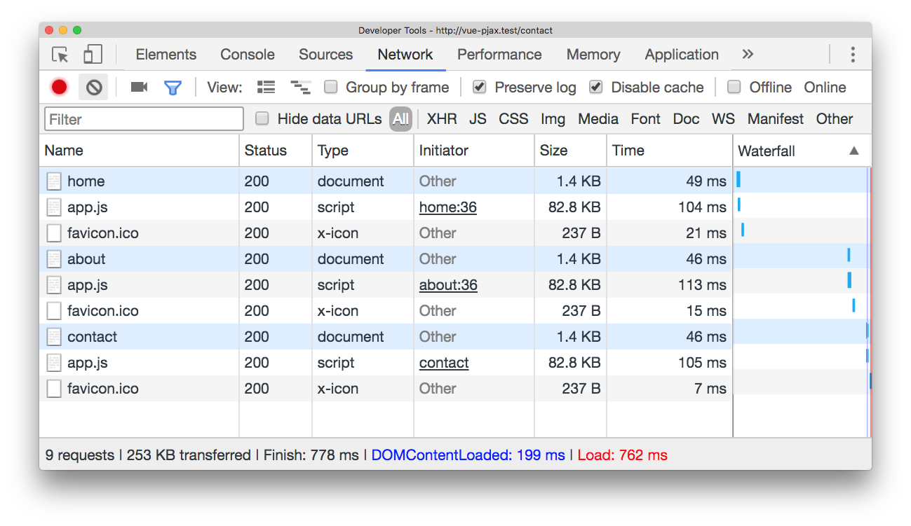
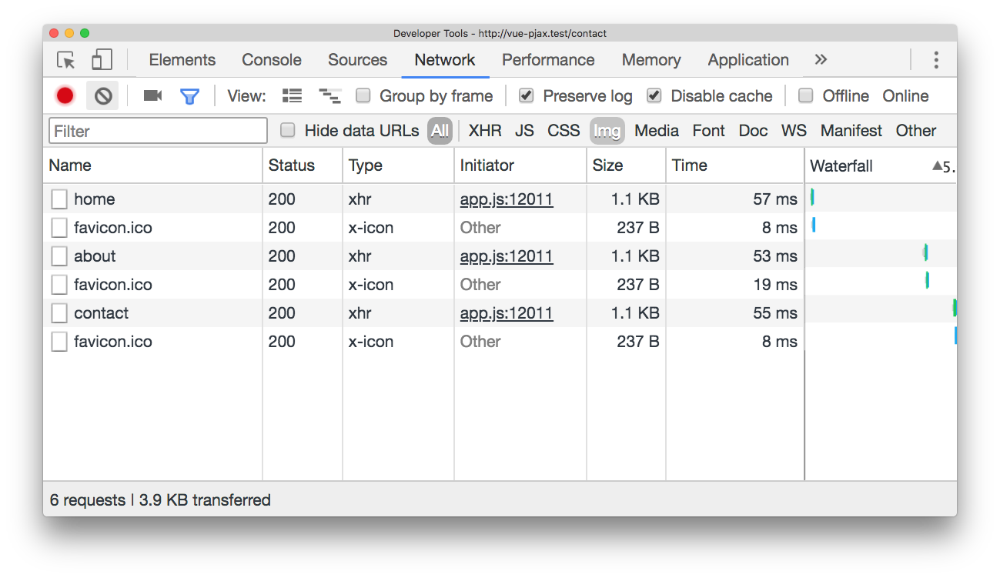

# PJAX adapter for Vue
This Vue plugin was inspired by [defunkt/jquery-pjax](https://github.com/defunkt/jquery-pjax) and depends on [spatie/laravel-pjax](https://github.com/spatie/laravel-pjax).

Those people who use VueJS extensively in their (non-SPA) projects, PJAX could be lifesaving when optimising the user experience. Simply put, PJAX uses AJAX requests to manipulate the DOM at time of page changes thus reducing the load over the network and therefore improving response times.

## Dependencies
The plugin itself depends on the [`vue`](https://www.npmjs.com/package/vue) and [`axios`](https://www.npmjs.com/package/axios) libraries and has been built to consume the PJAX server responses provided by the [`spatie/laravel-pjax`](https://packagist.org/packages/spatie/laravel-pjax) package.

## Installation
First things first, open up your terminal and pull in the plugin.
```sh
$ npm install riverskies/vue-pjax-adapter
```

Next, you will have to specify the target container in your blade template. In the example below we called it `#pjax-container` (which is the default by the way).
```html
<div id="app">
    @include('partials.header')

    <div>
        @include('partials.navigation')

        <main id="pjax-container">
            @yield('content')
        </main>
    </div>
</div>
```

Now go to your `app.js` file where you set up Vue and initialise the plugin.
```javascript
require('./bootstrap');
window.Vue = require('vue');

import pjaxAdapter from 'vue-pjax-adapter';
window.Vue.use(pjaxAdapter);

// or if you don't like the default target, you can override it
// window.Vue.use(pjaxAdapter, {
//     targetSelector: '#my-custom-target',
// });

const app = new Vue({
    el: '#app'
});
```

As the final step, you will have to [install Spatie's PHP library](https://github.com/spatie/laravel-pjax#installation) to play ball on the server side.

Once done, head to your browser and see the magic happen! 

## Options
You can override the default target container if you need to at time of initialisation.
```javascript
window.Vue.use(pjaxAdapter, {
    targetSelector: '#my-custom-target',
});
``` 

Should you have any links you want to disable the PJAX behaviour for, you can do so in two ways: by adding the `data-no-pjax` attribute or by adding the `no-pjax` class. 
```html
<a href="/my-non-pjax-link-1" data-no-pjax>External Link 1</a>
<a href="/my-non-pjax-link-2" class="no-pjax">External Link 2</a>
```

If you have many of those under a common parent, you can do so by disabling the PJAX behaviour on the parent itself using either of the methods above.
```html
<div data-no-pjax>
    <div>
        <h1>Some external links</h1>
        <ul>
            <li><a href="/my-non-pjax-link-1">External Link 1</a></li>
            <li><a href="/my-non-pjax-link-2">External Link 2</a></li>
            <li><a href="/my-non-pjax-link-3">External Link 3</a></li>
        </ul>
    </div>
    <div>
        <h1>Even more external links</h1>
        <ul>
            <li><a href="/my-non-pjax-link-4">External Link 4</a></li>
            <li><a href="/my-non-pjax-link-5">External Link 5</a></li>
            <li><a href="/my-non-pjax-link-6">External Link 6</a></li>
        </ul>
    </div>
</div> 
```

## How it works
The plugin attaches an event listener to all the `a[href]` tags on your page at time of initialisation. When you click the link and you haven't disabled the PJAX behaviour, it takes over by preventing the default action and works with Spatie's PHP library to bring only the relevant content from the backend. Otherwise, it will let the default click event fall through and go on its merry way. 

## Performance
Configuration: 
- fresh install of Laravel with VueJS and Axios (nothing else);
- a three link navigation: `ul > li > a`, nothing more complex;
- three pages with only an `h1` tag on each;
- all run by Laravel Valet on localhost. 

Test results without using the plugin:


Test results with the plugin:


## Bugs
Please report bugs using the [issue tracker](https://github.com/riverskies/vue-pjax-adapter/issues).

## Contributing
You are more than welcome to help me maintain and extend this plugin. 

## About us 
[Riverskies Development Limited](https://riverskies.com) is a small software development company based in Surrey, UK.
